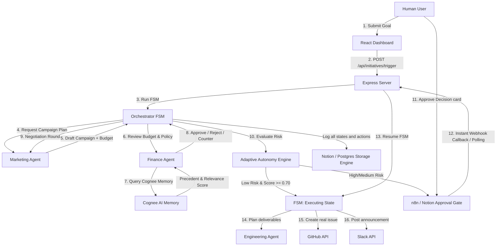

# CorpusAI

**Frontend -** https://corpus-ai-beryl.vercel.app/
<br>
**Backend -** https://corpusai-2ftb.onrender.com

CorpusAI is a multi-agent autonomous enterprise operating system that enables departments (Marketing, Finance, Engineering) to coordinate, negotiate, and execute complex corporate workflows under a centralized, FSM-guarded state machine. Powered by AI reasoning and backed by a Notion/PostgreSQL control plane, it turns static documentation databases into active execution engines.

---

## 🏗️ System Architecture



---

## ⚡ Unique Selling Propositions (USPs)

*   **Pluggable Control Plane (Notion or PostgreSQL):** Managers trigger objectives, inspect progress, and authorize budgets directly inside Notion databases or high-throughput PostgreSQL/Supabase tables (`STORAGE_BACKEND`).
*   **FSM-Guarded Workflows:** Multi-agent collaboration is boxed inside a strict Finite State Machine. This prevents infinite hallucination loops, runaway spending, and rogue agent behavior.
*   **Semantic Adaptive Autonomy & Cognee AI Memory:** Automatically computes decision risk using rule-based 15% budget variance and Cognee Knowledge Graph precedent matching. Requires both budget ceiling compliance and a strong semantic match score ($\ge 0.70$) for auto-approval.
*   **n8n Enterprise Workflow Automation:** Seamlessly dispatches approval requests to n8n workflows for Slack/Email interactive sign-off, with instant state machine resumption via webhook callbacks.
*   **Audit-Log Ledger Persistence:** Every LLM prompt, thought process, disagreement, and tool activation is permanently recorded in a structured database ledger.

---

## ⚙️ Enterprise Feature Flags & Configuration

CorpusAI supports flexible backend provider switching via environment variables in `orchestrator/.env`:

| Flag | Options | Default | Description |
|---|---|---|---|
| `STORAGE_BACKEND` | `notion` \| `postgres` | `notion` | Primary storage engine for Initiatives, Agent Logs, Decisions, and Actions. |
| `APPROVAL_BACKEND` | `notion` \| `n8n` | `notion` | Human approval gateway. `n8n` triggers external workflows with instant webhook callbacks. |
| `COGNEE_ENABLED` | `true` \| `false` | `false` | Enables Cognee Knowledge Graph semantic precedent memory & Graph RAG. |

### 🔍 Technical Limitations & Architectural Trade-offs
1. **PostgreSQL Security Model**: In Notion mode, per-agent tokens enforce capability-based database access permissions. In Postgres mode (`STORAGE_BACKEND=postgres`), table access permissions are enforced in-process in JavaScript (`checkPermission()`).
2. **Cognee Match Score Thresholding**: Cognee precedent queries return a normalized relevance score ($0.0 - 1.0$). To prevent false-positive auto-approvals, auto-approval requires both `amount <= $8000` and `relevanceScore >= 0.70`.
3. **Active Backend Header Badges**: The frontend dashboard automatically queries `GET /api/config` to display visual badges indicating active storage, approval, and memory engines for demo credibility.

---

## ✨ Key Visual Features

*   **Active Backend Indicator Badges**: Displays current active engines (`Storage: NOTION/POSTGRES`, `Approval: NOTION/N8N`, `Memory: COGNEE`) in the top dashboard bar.
*   **D3.js Lineage Graph with Animated Flow Particles**: A dynamic, force-directed node diagram tracking active agent pathways with glowing neon flow particles.
*   **Live Agent Negotiation Chat**: High-fidelity message console displaying the actual dialogue between Marketing and Finance agents as they negotiate budget proposals.
*   **Deliverables & Execution Proof Panel**: Dedicated UI section presenting live links to created GitHub Issues and Slack Announcements.
*   **WebSocket Activity Terminal**: Real-time scrolling developer terminal printing state-machine ticks and middleware resolutions.

---

## 🛠️ Technology Stack

| Layer | Technologies |
|---|---|
| **Frontend** | React 19, Vite, TypeScript, D3.js (Visual Lineage), Recharts (Analytics), Lucide Icons |
| **Backend** | Node.js, Express, WebSockets (`ws`), TypeScript |
| **State Machine** | Custom FSM class with Notion/Postgres storage interceptor middleware |
| **Storage Engines** | Notion API (`@notionhq/client`) & PostgreSQL / Supabase (`pg`) |
| **AI Memory** | Cognee AI Knowledge Graph API (`multipart/form-data` ingest, Graph RAG, Hybrid Search) |
| **Automation** | n8n Webhook Approval Workflows, GitHub API (Octokit), Slack Web API |
| **AI Layer** | NVIDIA NIM API (OpenAI-compatible), GPT-4o / LLama3 |

---

## 🏃 Running & Testing the Application

### 1. Start Orchestrator Backend
From `orchestrator`:
```bash
npm run dev
```

### 2. Start Frontend Dashboard
From `frontend`:
```bash
npm run dev
```

### 3. Run Integration Guides
* **n8n Workflow Setup**: See [N8N_SETUP.md](file:///c:/Users/Yash/Documents/antigravity/excited-volta/CorpusAI/orchestrator/N8N_SETUP.md) for importing `corpusai-approval-workflow.json`.
* **Isolated Testing Guide**: See [TESTING.md](file:///c:/Users/Yash/Documents/antigravity/excited-volta/CorpusAI/orchestrator/TESTING.md) for step-by-step commands to test Postgres, Cognee, and n8n independently.
